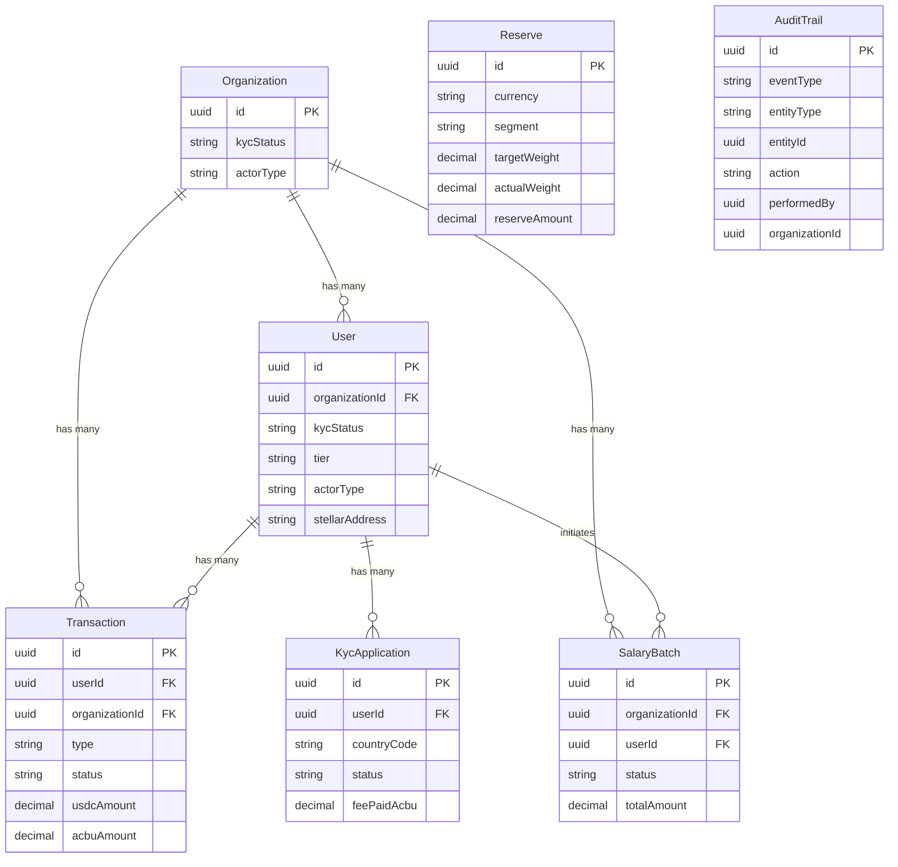

# Database Architecture Overview

## Introduction

`acbu-backend` uses **PostgreSQL** as its database, accessed via the **Prisma ORM** (`prisma/schema.prisma`). The schema defines **30 models** organized across **5 functional domains**:

| Domain | Models |
|---|---|
| [Identity & Auth](./domains/auth-identity.md) | Organization, User, ApiKey, UserPasskey, UserDevice, Guardian, UserContact, OtpChallenge, RefreshToken, RecoveryAttempt |
| [KYC](./domains/kyc.md) | KycApplication, KycDocument, KycValidator, KycValidation, KycValidatorReward |
| [Transactions & Payments](./domains/transactions-payments.md) | Transaction, OnRampSwap, Webhook, InvestmentWithdrawalRequest |
| [Payroll](./domains/payroll.md) | SalaryBatch, SalaryItem, SalarySchedule, BulkTransferJob |
| [Treasury & Reserve](./domains/treasury-reserve.md) | Reserve, ReserveHistory, OracleRate, AcbuRate, BasketMetrics, BasketConfig, RebalancingEvent |

Cross-cutting concerns: **AuditTrail**, **InvestmentStrategy** (see [below](#cross-cutting-concerns)).

---

## Bird's-Eye View

The diagram below shows the 7 core entities and their primary relationships. Detail-level diagrams are in each domain file.

---

## Cross-Cutting Concerns

### AuditTrail

`AuditTrail` is a system-wide immutable event log. It is not foreign-keyed to any specific table; instead, it stores `entityType` (e.g., `"user"`, `"transaction"`) and `entityId` as generic identifiers, allowing it to reference any entity without hard FK constraints. Every privileged action — KYC decisions, API key creation, balance operations, rebalancing events — writes a row here. It also records `actorType`, `keyType`, and `organizationId` for full audit lineage.

### InvestmentStrategy

`InvestmentStrategy` defines yield strategies that the treasury module uses to deploy reserve capital. It is a reference/configuration table with no FK relationships to other tables in the schema. It holds policy limits (`policyLimitUsd`), current deployment (`deployedNotionalUsd`), target yield (`targetApyBps`), and a `riskTier` classifier. It is used by the investment allocation service at the application layer, not at the database constraint layer.

---

## Maintenance Guide

### Source of Truth

`prisma/schema.prisma` is the **single source of truth** for all schema information. Documentation in this directory is derived from it and must be kept in sync manually after schema changes are merged.

### What to Update for Each Change Type

| Change | Files to Update |
|---|---|
| **Add a model** | `database-overview.md` (domain table + bird's-eye if it's a core entity), the relevant `domains/*.md` file |
| **Remove a model** | `database-overview.md`, the relevant `domains/*.md` file |
| **Add/remove a relationship** | The `domains/*.md` file for every domain whose ERD includes one of the two entities |
| **Add a meaningful field** (PK/FK/unique) | The `domains/*.md` file for the owning entity's domain |
| **Change a field type or name** | The `domains/*.md` file for the owning entity's domain |
| **Move a model to a different domain** | `database-overview.md` domain table, source `domains/*.md`, destination `domains/*.md` |

### Validation

Before merging documentation changes:
1. Paste each `erDiagram` block into the [Mermaid Live Editor](https://mermaid.live) or open a GitHub preview to confirm it renders without errors.
2. Verify that all FK references in the diagram match the `@relation` annotations in `schema.prisma`.
3. Confirm relationship cardinalities match the nullable/required status of FK fields in the schema (nullable FK → zero-or-one side `o|`).
