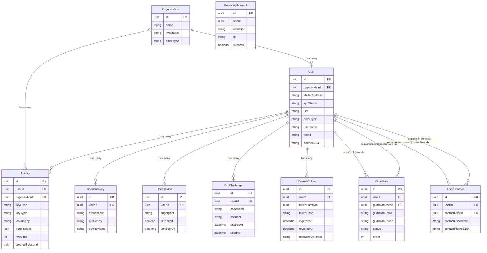

# Identity & Auth Domain

## Description

The Identity & Auth domain is the foundation of the system. It manages organizations and individual users, the API keys and WebAuthn passkeys they use to authenticate, trusted device fingerprints, social-recovery guardians, address book contacts, OTP verification challenges, JWT refresh token families, and account-recovery audit logs. Every other domain references either `Organization` or `User` (or both) as its primary ownership anchor.

---

## Entity-Relationship Diagram

---

## Business Logic Notes

### Organization / User relationship
`User.organizationId` is nullable — retail users have no organization. Business users (SME, enterprise, merchant, government) belong to exactly one `Organization`. The `actorType` field on both entities mirrors this distinction.

### ApiKey polymorphism
An `ApiKey` belongs to **either** a `User` or an `Organization`, never both simultaneously (though both FKs are nullable in the schema to allow the constraint to be enforced at the application layer). The `keyType` enum (`USER_KEY`, `ADMIN_KEY`, `BREAK_GLASS_KEY`) governs the scope of access, and `permissions` is a JSON array of segment-scoped strings (e.g., `"p2p:write"`, `"gateway:read"`).

### Guardian self-referential relationships
`Guardian` links two `User` rows: `userId` is the account holder being protected ("the ward"), and `guardianUserId` is the trusted contact who can assist in recovery ("the guardian"). A user can be both a ward (have their own guardians) and a guardian for others. `guardianUserId` is nullable because a guardian may be invited by email/phone before they have a registered account.

### UserContact self-referential relationships
`UserContact` is an address-book entry. `userId` owns the contact list; `contactUserId` is the referenced user (nullable — contacts can be stored by phone/username before the contact registers).

### OtpChallenge lifecycle
Each row represents a single-use challenge sent via `sms` or `email`. The `usedAt` timestamp marks consumption; `expiresAt` marks expiry. Rows are not deleted on use — they serve as an audit trail.

### RefreshToken rotation
Tokens are organized into families via `tokenFamilyId`. When a token is rotated, the old row gets `revokedAt` set and `replacedByToken` populated. Detecting reuse of a revoked token triggers revocation of the entire family.

### RecoveryAttempt
`RecoveryAttempt` has no FK constraint on `userId` — it stores the UUID string but does not enforce referential integrity. This allows recovery audit records to survive even if a user account is hard-deleted. `identifier` holds the contact value used (email or phone) during the attempt.
