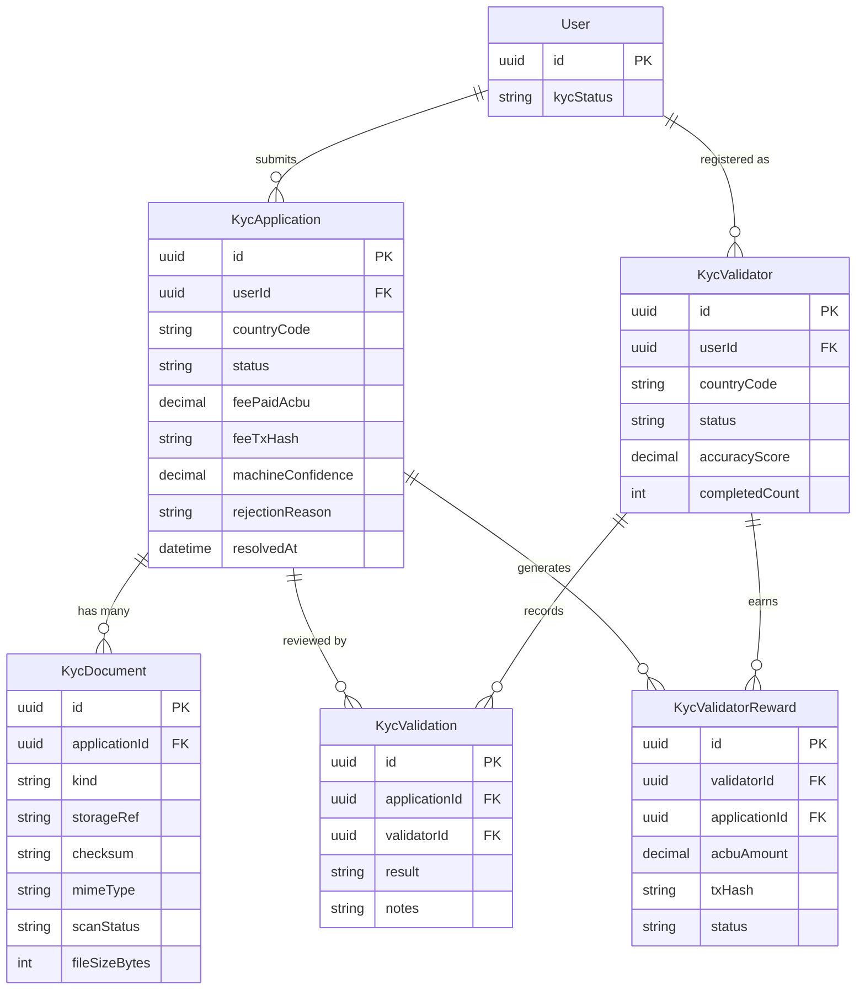

# KYC Domain

## Description

The KYC (Know Your Customer) domain handles identity verification for users. A user submits a `KycApplication` with supporting `KycDocument` uploads. Trained `KycValidator` users review each application and record their decision as a `KycValidation`. Validators earn ACBU token rewards tracked in `KycValidatorReward`. Machine-confidence scoring supplements the human review process.

---

## Entity-Relationship Diagram

---

## Business Logic Notes

### KycApplication status lifecycle
Applications progress through statuses: `pending` → `under_review` → `approved` | `rejected`. The `machineConfidence` score (0–1) from automated document scanning influences routing — high-confidence applications may be auto-approved; low-confidence ones are queued for human review. `rejectionReason` is populated on rejection.

### KycDocument scanning
Each document (`passport`, `national_id`, `selfie`, etc.) stored in cloud object storage is tracked via `storageRef`. The `scanStatus` field (`pending` → `clean` | `flagged`) reflects the result of virus/malware scanning. `fileSizeBytes` is captured for storage quota enforcement.

### KycValidator country specialization
A `KycValidator` is registered with a `countryCode`, meaning validators are matched to applications from their country. The `@@unique([userId, countryCode])` constraint means a user can be a validator for multiple countries but only once per country. `accuracyScore` is updated after each decision is reconciled against ground truth.

### KycValidation consensus
Multiple validators review the same application. `result` values are `pending`, `approve`, or `reject`. The application service aggregates validation results to reach a final consensus decision.

### KycValidatorReward payout
When a validator's decision is confirmed correct, a `KycValidatorReward` row is created with `status: pending`. The treasury service mints ACBU tokens on-chain and records the `txHash`. The status transitions to `completed` once the blockchain transaction confirms.

### Cross-domain note
`KycApplication.feeMintTransactionId` references a `Transaction` in the Transactions & Payments domain (no DB-level FK constraint; application-layer reference). This tracks the on-chain ACBU fee payment made by the user to submit their KYC application.
