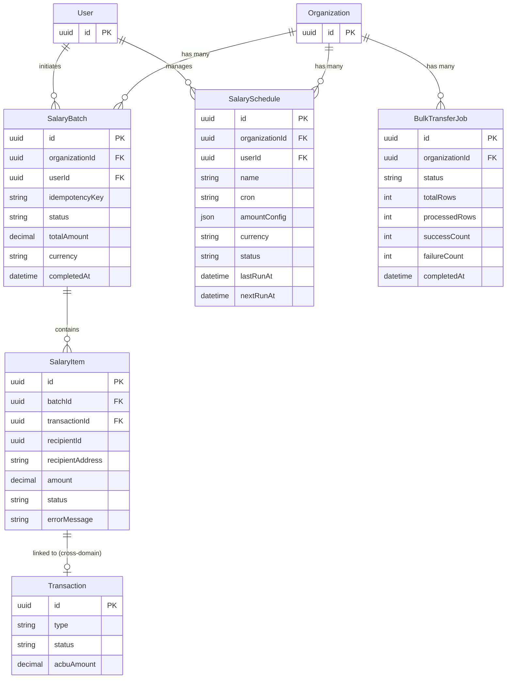

# Payroll Domain

## Description

The Payroll domain enables organizations to disburse salaries in ACBU tokens. An organization initiates a `SalaryBatch` containing multiple `SalaryItem` recipients. Recurring payroll is automated via `SalarySchedule` (cron-based). Large one-time disbursements via CSV upload are tracked as `BulkTransferJob` records. Each successfully executed salary item is linked to a `Transaction` in the Transactions & Payments domain.

---

## Entity-Relationship Diagram

---

## Business Logic Notes

### SalaryBatch ownership
`SalaryBatch.organizationId` is nullable — sole traders or individual users without an org can also run batches. `userId` is required and identifies the initiating user. The `@@unique` idempotency key prevents duplicate batch submissions.

### SalaryBatch status lifecycle
Status progresses: `pending` → `processing` → `completed` | `failed` | `partial`. A batch reaches `completed` when all its items succeed; `partial` when some items fail after all have been attempted.

### SalaryItem and Transaction linkage
Each `SalaryItem` has a unique `transactionId` FK pointing to a `Transaction` in the Transactions & Payments domain. The `@unique` constraint on `transactionId` ensures each transaction is tied to exactly one salary item (one-to-one). `transactionId` is nullable until the disbursement is submitted on-chain. `recipientId` is a non-FK UUID reference to a `User` row (application-layer lookup).

### SalarySchedule cron automation
`cron` stores a standard cron expression that the scheduler service evaluates. `amountConfig` is a JSON object defining per-recipient amounts or a formula. `nextRunAt` is pre-computed after each run and used as the scheduler query index. Status values are `active` and `paused`.

### BulkTransferJob CSV processing
`totalRows` is set at upload time from the CSV row count. `processedRows`, `successCount`, and `failureCount` are incremented as rows are processed asynchronously. `failureReport` is a JSON array of failed rows with error details, available for download once the job completes.

### Cross-domain note
`Transaction` (shown here for context) is defined in the Transactions & Payments domain. The `SalaryItem → Transaction` relationship crosses domain boundaries; refer to [transactions-payments.md](./transactions-payments.md) for the full Transaction entity definition.
