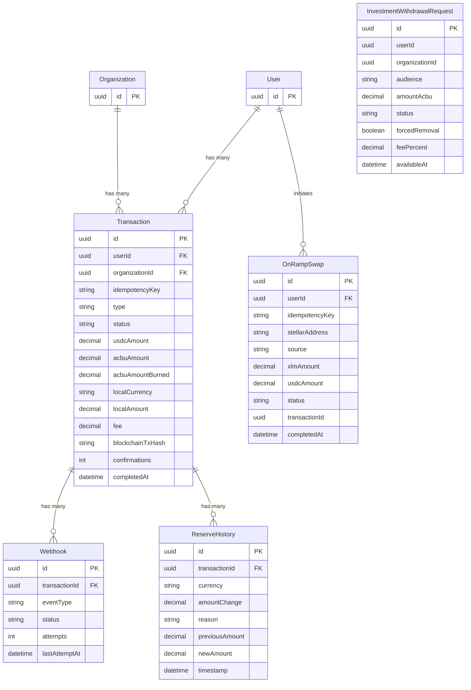

# Transactions & Payments Domain

## Description

The Transactions & Payments domain is the core ledger of the system. Every value movement — mints, burns, P2P transfers, on-ramp swaps, and fee charges — produces a `Transaction` row. On-ramp deposits flow through `OnRampSwap` before becoming transactions. Event delivery to external parties is managed via `Webhook`. Investment redemptions are queued as `InvestmentWithdrawalRequest` records.

---

## Entity-Relationship Diagram

---

## Business Logic Notes

### Transaction ownership
A `Transaction` is owned by a `User`, an `Organization`, or both. Both FKs are nullable: retail user transactions set only `userId`; organization-initiated batch or bulk transactions may set only `organizationId`; some operations (e.g., salary payouts) set both.

### Transaction type and status
`type` identifies the operation class (e.g., `mint`, `burn`, `p2p_transfer`, `salary_payout`, `fee_charge`). `status` progresses through `pending` → `processing` → `completed` | `failed`. The composite unique constraint `(type, blockchainTxHash)` prevents duplicate burn submissions on the same blockchain transaction hash while allowing the same hash under other types (e.g., a confirmation receipt).

### Idempotency
`Transaction.idempotencyKey` (globally unique) prevents duplicate submissions from clients. Callers supply a client-generated key; if it already exists, the existing transaction is returned instead of creating a new one.

### OnRampSwap flow
A user deposits XLM or USDC. The `OnRampSwap` record tracks the conversion progress (`pending_convert` → `processing` → `completed` | `failed`). `transactionId` is an application-layer reference (no DB FK constraint) to the eventual `Transaction` created once conversion succeeds. `source` indicates the deposit asset (`xlm_deposit` or `usdc_deposit`).

### Webhook delivery
Each `Webhook` targets an external endpoint for a transaction event (e.g., `transaction.completed`). `attempts` is incremented on each delivery try; `lastAttemptAt` records the most recent attempt. Status cycles: `pending` → `delivered` | `failed`.

### ReserveHistory linkage
Every `Transaction` that affects the reserve (mint/burn/rebalance/conversion) produces one or more `ReserveHistory` rows. `reason` values are `mint`, `burn`, `rebalance`, or `conversion`. This provides an immutable audit trail of reserve balance changes with before/after values.

### InvestmentWithdrawalRequest
This entity queues redemption requests from both retail users (`audience: retail`) and business accounts (`audience: business`). Neither `userId` nor `organizationId` carry DB-level FK constraints here — they are stored as UUIDs for lookup. `availableAt` encodes the unlock time (24 hours for retail; calendar-based for business). `forcedRemoval` flags early redemptions that incur the `feePercent` penalty.

### Cross-domain note
`SalaryItem` (Payroll domain) holds a `transactionId` FK that points to a `Transaction` here, creating the linkage between a payroll disbursement and its ledger record.
