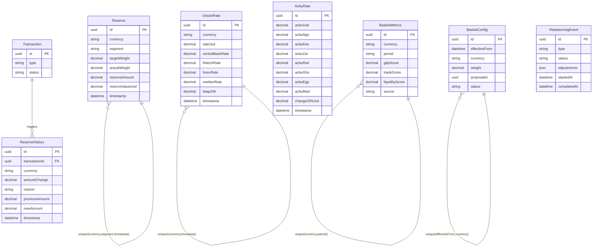

# Treasury & Reserve Domain

## Description

The Treasury & Reserve domain manages the ACBU token's backing reserve and price oracle infrastructure. `Reserve` snapshots track the reserve composition by currency and segment. `ReserveHistory` provides an immutable change log tied to transactions. `OracleRate` aggregates multi-source FX rates. `AcbuRate` records the ACBU token price in multiple currencies. `BasketMetrics` and `BasketConfig` govern the statistical model that determines currency weights in the basket. `RebalancingEvent` tracks rebalancing operations triggered by drift or scheduled policy changes.

---

## Entity-Relationship Diagram

---

## Business Logic Notes

### Reserve snapshots
`Reserve` stores periodic snapshots of the reserve state. The `@@unique([currency, segment, timestamp])` constraint makes each row a point-in-time snapshot for a given `currency` + `segment` combination. `segment` distinguishes between `transactions` (operational reserve) and `investment_savings` (yield-generating capital). `targetWeight` vs `actualWeight` drives drift detection.

### ReserveHistory and Transaction linkage
`ReserveHistory.transactionId` FK links reserve changes back to the causative `Transaction` (defined in the Transactions & Payments domain). `reason` values — `mint`, `burn`, `rebalance`, `conversion` — classify the change type. `previousAmount` and `newAmount` provide a complete before/after record.

### OracleRate aggregation
Each `OracleRate` row aggregates rates from multiple sources for the same `currency` at a given `timestamp` (unique constraint). `centralBankRate`, `fintechRate`, and `forexRate` are the individual source inputs; `medianRate` is the consensus value used by the system; `twap24h` is the time-weighted average price over 24 hours for smoothing. `validatorSignatures` (omitted from diagram for clarity) stores cryptographic signatures from oracle validators.

### AcbuRate price snapshots
`AcbuRate` records the ACBU token price in USD and a set of African currencies (NGN, KES, ZAR, RWF, GHS, EGP, MAD, TZS, UGX, XOF) at a point in time. `change24hUsd` is a pre-computed percentage change used by client apps for display.

### BasketMetrics derivation
`BasketMetrics` stores per-currency, per-period scores (GDP, trade volume, liquidity) sourced from external APIs and internal data. The `@@unique([currency, period])` constraint ensures one score set per currency per reporting period. These scores feed the weight calculation algorithm that produces `BasketConfig` proposals.

### BasketConfig lifecycle
`BasketConfig` rows represent proposed or active basket weight assignments. `status` progresses through `proposed` → `approved` → `active`. The `@@unique([effectiveFrom, currency])` constraint means there is exactly one weight per currency per effective date. The application layer reads the latest `active` rows to determine current basket composition.

### RebalancingEvent
`RebalancingEvent` records system-triggered or DAO-triggered rebalancing operations. `type` identifies the trigger (e.g., `drift_threshold`, `scheduled`, `emergency`). `adjustments` is a JSON object describing the buy/sell actions taken per currency. `completedAt` is null until the event finishes.

### Cross-domain note
`ReserveHistory.transactionId` references `Transaction` in the Transactions & Payments domain. Refer to [transactions-payments.md](./transactions-payments.md) for the full Transaction entity definition. `Transaction` is shown here with minimal fields for relationship context only.
